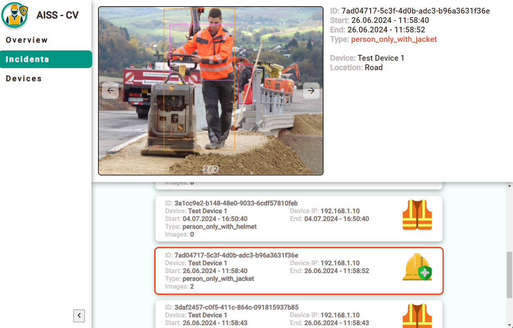

# Application

This project uses [Angular](https://angular.dev/overview) v18.0.5 and [Electron](https://www.electronjs.org/) v31.0.2 <br>

Using **Electron** comes with the advantage of being *cross-platform* by default, compatible with macOS, Windows, and Linux. <br>
By embedding Chromium and Node.js, Electron enables web developers to create desktop applications with a native graphical user interface without the need for a native codebase. <br>

The decision to use **Angular** for the Frontend was primarily based on the prior experience of the team with this technology. Alternative frameworks like React.js or Vue.js would also be possible to integrate into an Electron desktop application.

## Requirements
The following requirements must be satisfied to be able to (locally) run this application.
- Install Node.js and npm. <br> We recommend to use [nvm](https://www.freecodecamp.org/news/how-to-update-node-and-npm-to-the-latest-version/) for handling this installation.
- Go to the terminal and run `npm install` to install all necessary node modules that are required to run the app.
- Install [MongoDB Community Server](https://www.mongodb.com/try/download/community) for the database that will hold our device and incident data. <br>
(Make sure that MongoDB is running on the standard port :227017).
- [Optional]: During development, 'MongoDB Atlas' can be very helpful to get an easy access to the data in the database.
- [Optional]: During development, [Postman](https://www.postman.com/downloads/?utm_source=postman-home) can be very helpful to create **HTTP-Requests** that can mock the behavior of the Jetson Nano Devices.

After completing these steps, you should be ready to start the application. <br>
Run `npm run electron` to locally start the application or run `npm run make` to create a distributable for your operating system.

# Architecture
Since one of the main benefits of the **Jetson Nano Device** is that it can run machine learning models locally, we challenged ourself to find and implement a use case that also does not need any internet to function. <br>

As depicted in the overview image in the main [README.md](../README.md), the idea was to build a [model](../training/README.md) for detecting PPE-equiment violations on construction sites which are prone to have poor internet connection. <br>
We would then run that model on [Jetson Nano Devices](../jetson/README.md) on the construction site which have access to some camera feed. When the device detects a violation, it would send the violation data with **HTTP-Requests** over a **local area network**. <br>

In some king of safety booth, there is one **main computer** that receives and persists the data from all the detection devices using this **Electron application**. <br>
This applications consists of an [Electron frame](#electron) that runs the [Express Server](#server) as a **utility-process** and integrates an [Angular Frontend](#frontend) into the desktop application. <br>
The server provides several **HTTP endpoints** that allow the Jetson devices to send their detection results to the **database** and enables the Frontend to *access and modify* that data.


## Electron
As stated before, **Electron** is responsible for actually creating the (native) desktop application which contains the **Angular Frontend** and runs the **Express Server**. <br>

The primary code for the Electron setup is located in the [main.js](./main.js) file. <br>
The `createWindow()` method can be used to define the size of the desktop app window, set app icons and define the Frontend application that is displayed inside the app window. <br>

`app.whenReady()` is used to define actions that should be executed during the application startup, such as starting the Server as a [utilityProcess](https://www.electronjs.org/docs/latest/api/utility-process) which is Electron's version of a [childProcess](https://nodejs.org/api/child_process.html#child_processforkmodulepath-args-options). Such a `utilityProcess` enables us to spawn a subprocess for the Server code that can run separately and communicates with the parent process using the `process.on(...)` and `process.postMessage(...)` syntax. <br>

`app.on('window-all-closed', ...)` is an Electron *event listener* that gets executed during the app shutdown process after the desktop app window is closed. <br>
We use this event to initiate a **graceful shutdown** of the Server utilityProcess and Database Connection and then quit the app.

## Server
The **Server** is responsible for managing the **Database Connection** and offering **HTTP Endpoints** that allow creating, receiving, deleting or modifying the data for detection devices and PPE-equipment violation incidents. <br>
The primary code for the Server is located in the [server.js](./server/server.js) file. <br>

### Database
As stated before, this application uses a [MongoDB](https://www.mongodb.com/de-de) database, which is a very popular document-based database. <br>
The main reason for using MongoDB instead of a relational database was the ease of use during development. Thanks to **mongoose**, it is very easy to save and retreive JavaScript objects in the database without the need for a more complex setup of different tables and a more complex schema. <br>
Further, this application does not require complex database queries, which would be one of the main benefits of using a relational database instead of a document-based one.

To connect to the **Database** and define a **data schema**, the Server utilizes [mongoose](https://mongoosejs.com/) which reduces boilerplate code and simplifies the process of interacting with the MongoDB database. <br>
`mongoose.connect('mongodb://localhost:27017/detectiondb', {});` ist the only method call that is needed to start a connection to MongoDB and - if not yet existing - creating the "detectiondb" database. <br>

The schemas for our database are defined in the "/data" folder. <br>
To create a new schema, you simply import mongoose and use the Schema class to define it. <br>
To add the new schema to the database, you can use the `mongoose.model(...)` method.
``` 
const mongoose = require('mongoose');
const Schema = mongoose.Schema;

const dataSchema = new Schema({
  ...
});
module.exports = mongoose.model('Data', dataSchema);
```
These schemas can then be used in the HTTP-Request to create, modify, receive, or delte data in the MongoD database.

### Express
This app uses the popular Node.js framework [Express](https://expressjs.com/de/) to define **HTTP Endpoints** through which the **Jetson Nano Devices** and the **Angular Frontend** can interact with the data in the **database**. <br>


## Frontend





# Deployment

## Build

Run `ng build` to build the project. The build artifacts will be stored in the `dist/` directory.

## Publish
Run ...
